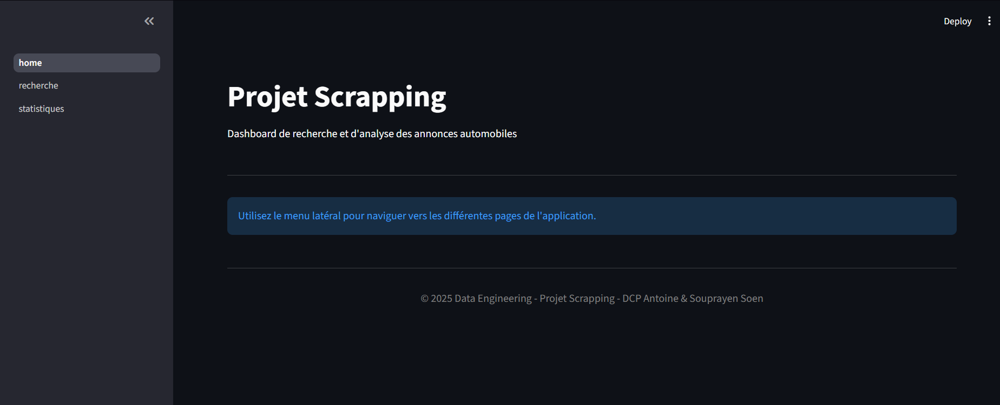
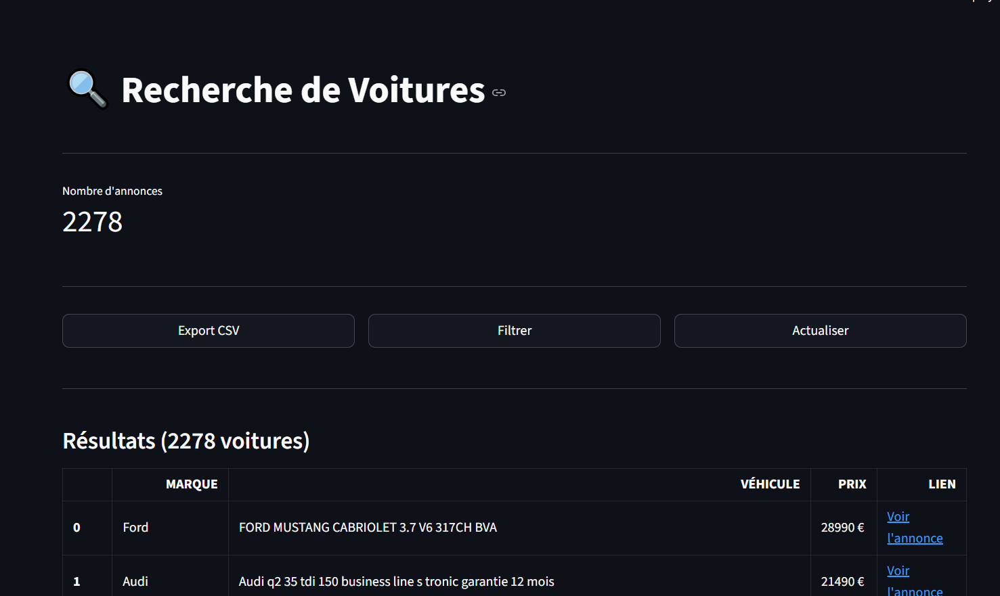
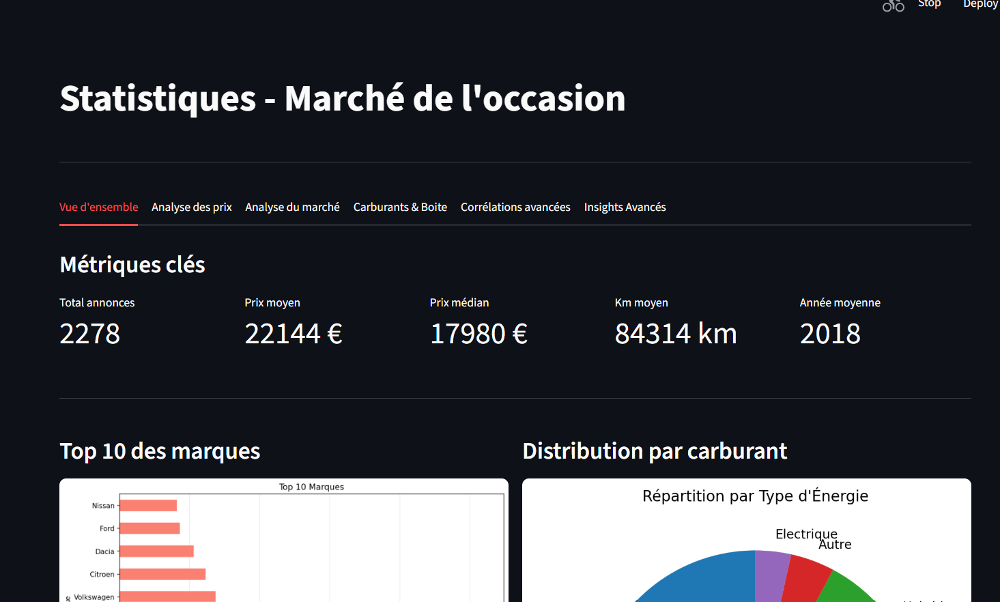

# Documentation du Crawler ParuVendu

Ce projet consiste à recupérer des données sur un site  en utilisant **Scrapy**. On procède donc à une récuperation automatique des annonces automobiles sur le site ParuVendu, de nettoyer les données, et de les stocker dans une base de données **MongoDB** et ensuite de les afficher en utilisant **Streamlit**.

##  Structure des fichiers de Scraping

Voici le rôle détaillé de chaque fichier présent dans le dossier `scrappy/crawler/`.

### 1. `paruvendu_spider.py`
C'est le cœur du projet. Ce script est responsable de la navigation sur le site web.

* **Rôle :** Il envoie les requêtes HTTP au site ParuVendu. Il récupère le HTML brut (Titre, Prix, Description, Lien).
* **Pagination :** Il détecte automatiquement le lien "Page suivante" pour parcourir toutes les pages de résultats.
* **Configuration :** Il définit le `USER_AGENT` pour imiter un navigateur et éviter d'être bloqué.

### 2. `pipelines.py` 
C'est ici que la donnée brute est transformée en donnée propre et exploitable. Une fois que le spider a trouvé une annonce, il l'envoie ici.

* **Filtrage :** Il rejette les annonces indésirables grâce à une liste (`EXCLUDED_KEYWORDS`) : tracteurs, jantes, pneus, locations, etc.

* **Extraction Intelligente :**
    * **Rôle :** Il utilise regex pour determiner les informations suivantes :
        * **Année** 
        * **Kilométrage :** (Nettoie et convertit le kilométrage en nombre entier.)
        * **Prix** 
* **Normalisation :** Donne et index les marques (ex: "Vw" devient "Volkswagen") et détecte le type de boîte de vitesse et l'énergie.
* **Stockage :** Se connecte à **MongoDB** et sauvegarde l'annonce.

### 3. `database.py`
Ce fichier sert de point central pour la configuration de la base de données.

### 4. `docker-compose.yml`
Ce fichier permet de lancer tout l'environnement en une seule commande.

* **Rôle :** Il crée et gère deux codes ci-dessus qui fonctionnent ensemble :
    1.  **MongoDB :** La base de données qui tourne dans un conteneur .
    2.  **Crawler :** Le code Python qui s'exécute.
    3.  **Webapp :** L'interface utilisateur Streamlit pour visualiser les données stockées.

Il relie les trois briques pour qu'elles puissent communiquer.


## Structure de la Webapp

Cette partie concerne l'interface utilisateur réalisée avec **Streamlit**, permettant de visualiser et d'analyser les données récoltées.

### 1. `home.py`
Point d'entrée de l'application. Affiche la page d'accueil et le titre du projet.



### 2. `pages/1_recherche.py`
Page dédiée à l'exploration des données.
* **Connexion MongoDB :** Récupère les données brutes depuis la base de données via `pymongo`.
* **Affichage :** Présente les annonces sous forme de tableau interactif pour faciliter la recherche.



### 3. `pages/2_statistiques.py`
Page dédiée à l'analyse approfondie du marché automobile.
* **Tableau de bord complet :** Organisé en plusieurs onglets (Vue d'ensemble, Analyse des prix, Analyse du marché, Carburants & Boite, etc.).
* **Visualisation :** Utilise `matplotlib` et `seaborn` pour générer des graphiques sur les corrélations entre prix, kilométrage, et année, ainsi que la répartition par carburant et boîte de vitesse.



## Structure du Projet 


```
.
├── docker-compose.yml      # Orchestration des conteneurs (App + BD + Spider)
├── dockerfile              # Image Docker pour l'application Streamlit
├── requirements.txt        # Dépendances Python globales
├── README.md               # Documentation du projet
├── scrappy/
│   └── crawler/            # Dossier du Crawler Scrapy
│       ├── paruvendu_spider.py # Le spider qui navigue sur le site
│       ├── pipelines.py    # Nettoyage et insertion en base
│       ├── database.py     # Configuration MongoDB
│       ├── dockerfile      # Image Docker spécifique au Crawler
│       └── requirements.txt # Dépendances spécifiques au Crawler
└── Webapp/                 # Dossier de l'Application Streamlit
    ├── home.py             # Page d'accueil
    └── pages/
        ├── 1_recherche.py  # Page de recherche
        └── 2_statistiques.py # Page de statistiques
```

## Comment lancer le projet

1.  Assurez-vous d'avoir **Docker** installé.
2.  Placez-vous dans le dossier racine du projet.
3.  Lancez la commande :

```bash
docker-compose up --build
```

Lien du site : http://127.0.0.1:8501/

